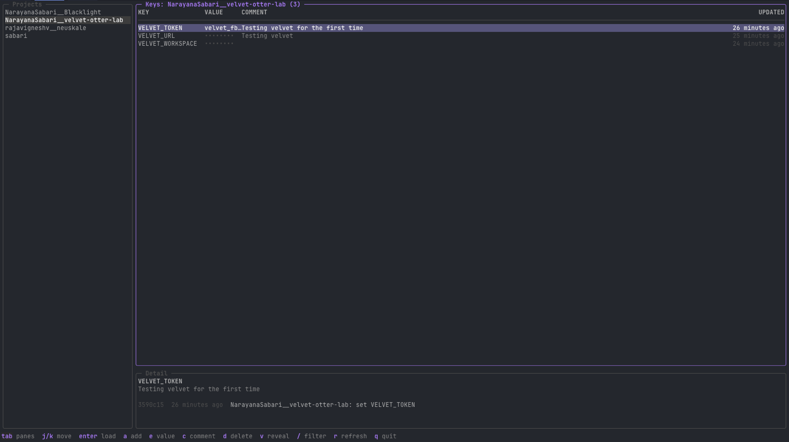

# envkit

Per-project .env vault with comments, git audit log, worktree-aware, agent-safe, with a lazydocker-style TUI.



[](https://github.com/NarayanaSabari/envkit/releases)
[](go.mod)
[](LICENSE)

## Why

- Secrets leak into coding-agent transcripts and cloud logs.
- `.env` files scattered across worktrees drift.
- There is no history of who changed what.
- There is no place for a comment saying what a key is for.

`envkit` fixes all four.

## Install

### Homebrew

```sh
brew install NarayanaSabari/tap/envkit
```

### Go

```sh
go install github.com/NarayanaSabari/envkit@latest
```

### Prebuilt binaries

Download a Darwin or Linux binary from [Releases](https://github.com/NarayanaSabari/envkit/releases).

### Source

```sh
git clone https://github.com/NarayanaSabari/envkit.git
cd envkit
make install
```

`make install` puts the binary in `~/.local/bin/envkit`.

## Quick start

```sh
cd my-project
printf '%s' 'example-secret' | envkit set API_TOKEN -m "Development API token"
envkit ls
# API_TOKEN  # Development API token
envkit run -- ./script-that-needs-the-token
```

## How it works

`envkit` stores each project file at `${ENVKIT_HOME:-$HOME/.envkit}/<project>/.env`.
The storage home is a local Git repository initialized by `envkit init` with mode 700.

A project name resolves in this order:

1. `ENVKIT_PROJECT`
2. `git config envkit.project`
3. The Git origin owner and repository
4. The worktree directory

Worktrees with the same origin share one `.env` file.
Every mutation creates a local Git audit commit, and `envkit log [KEY]` shows its history.
Values are written as-is, with no quoting or shell expansion.
Pipe values containing spaces or shell syntax directly to `envkit set`.

## Using with coding agents

Prefer a command boundary so a secret never needs to be printed:

```sh
envkit run -- your-command
```

When a process must load the file itself:

```sh
set -a; . "$(envkit path)"; set +a
```

Use `envkit ls` to show names and comments without values.
Have the user run `envkit set KEY` in their own terminal so the value never enters the chat.

Paste this into `AGENTS.md` or `CLAUDE.md`:

```md
## Secrets

- Keep secrets in envkit, not in repository `.env` files or chat messages.
- Use `envkit run -- command` when possible.
- If a process needs the file, run `set -a; . "$(envkit path)"; set +a`.
- Use `envkit ls` only for key names and comments.
- Never run `envkit get` or `envkit export`.
- Ask the user to run `envkit set KEY` in their own terminal for new values.
```

A pre-tool hook can block `envkit get`, `envkit export`, and direct `.env` reads to enforce this pattern before a command runs.

## Commands

| Command | Description |
| --- | --- |
| `init` | Initialize storage and print the project env path. |
| `path` | Create storage if needed, then print the `.env` path. |
| `project` | Print the resolved project name. |
| `version` | Print the envkit version. |
| `set KEY [-m COMMENT]` | Read a secret from stdin or a hidden terminal prompt and save it. |
| `unset KEY` | Remove a key and its directly preceding comments. |
| `comment KEY TEXT` | Set the comment directly above an existing key. |
| `ls` | List keys and comments, never values. |
| `get KEY` | Print one value. |
| `run [--] COMMAND...` | Execute a command with the project env loaded. |
| `export` | Print shell `export` statements. |
| `log [KEY]` | Show project history, or pickaxe history for one key. |
| `diff` | Show uncommitted changes in the env storage repository. |
| `edit` | Edit with `$EDITOR`, then commit changes. |
| `list` | List all saved projects. |
| `tui` | Open the interactive terminal interface. |

## TUI

`envkit tui` is a built-in Bubble Tea interface inspired by lazydocker.
It has a project pane, masked key table, selected-key comment and history pane, and a status bar.
Values are revealed only for the selected row and re-mask when the cursor moves.
Every mutation uses the same local Git audit log as the CLI.

| Key | Action |
| --- | --- |
| `tab`, `shift-tab` | Switch between Projects and Keys panes. |
| `j` / `k`, arrows | Move the cursor in the focused pane. |
| `enter` | Load the selected project. |
| `a` | Add a key, hidden value, and optional comment. |
| `e` | Edit the selected value with a hidden input. |
| `c` | Edit the selected comment. |
| `d`, then `y` / `n` | Delete the selected key with confirmation. |
| `v` | Reveal or mask the selected value. |
| `/` | Filter the focused pane. |
| `r` | Refresh projects and keys. |
| `esc` | Cancel an inline input. |
| `q`, `ctrl-c` | Quit. |

## Compared to

| Tool | Comments | Audit log | Worktree-aware | Offline | TUI |
| --- | --- | --- | --- | --- | --- |
| envkit | Yes | Yes | Yes | Yes | Yes |
| [envchain](https://github.com/sorah/envchain) | No | No | No | Yes | No |
| [dotenvx](https://dotenvx.com/) | No | No | No | Yes | No |
| [1Password CLI](https://developer.1password.com/docs/cli/) | Yes | Yes | No | No | No |
| [Doppler](https://www.doppler.com/) | Yes | Yes | No | No | No |

## Security notes

Secrets are stored as plain text at rest.
`envkit` relies on FileVault and storage permissions of mode 700 to protect local files.
`get` and `export` intentionally print secrets, so use them only in a safe terminal context.
Sync the storage repository to a private remote if you want an off-machine backup.
Encryption is out of scope for now.

## License

[MIT](LICENSE)
